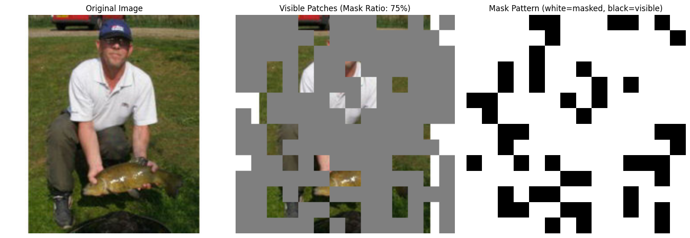
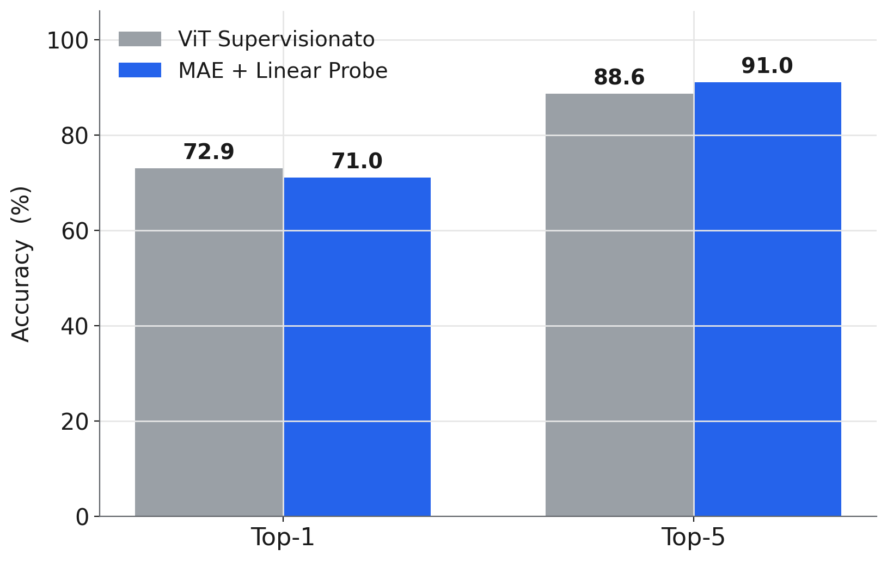
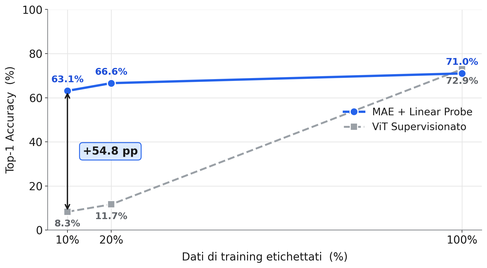
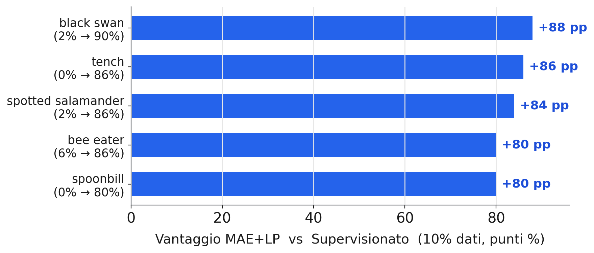
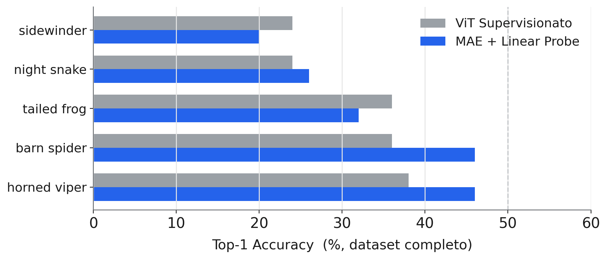

<!-- _class: lead -->
<!-- _paginate: false -->

Deep Learning · Advanced Models &amp; Methods

# Imparare nascondendo 

Track 11 — Masked Autoencoders for Image Representation Learning

<strong>Giovanni Torrisi</strong> · Gruppo G21 
github.com/GiovanniTorrisi28/Masked-Autoencoders-for-Image-Representation-Learning

---

# L'etichettatura è il collo di bottiglia della Computer Vision

Annotare milioni di immagini è **costoso e lento**.

**Domanda:** un Vision Transformer può imparare rappresentazioni utili *prima* di vedere una sola etichetta?

**Idea (self-supervised):** nascondi gran parte dell'immagine e chiedi al modello di **ricostruirla**.

<strong>ImageNet100</strong> · 100 classi · ~130K train · 5K val

<figcaption>Mascheriamo il 75% delle patch: resta visibile solo 1 patch su 4.</figcaption>

---

# Il MAE ricostruisce il 75% nascosto da un quarto di immagine

<h3>1 · Masking</h3>
Immagine → 196 patch 16×16. 
Si nasconde il <strong>75%</strong> (147 patch).

<h3>2 · Encoder ViT-Base</h3>
Vede <strong>solo le 49 patch visibili</strong>. 
~3× più leggero ed efficiente.

<h3>3 · Decoder leggero</h3>
Reinserisce i <em>mask token</em> e 
<strong>ricostruisce tutte</strong> le patch.

<strong>Loss:</strong> errore quadratico (MSE) sui pixel, calcolato <strong>solo sulle patch mascherate</strong> e normalizzato per patch → l'encoder è forzato a imparare la <em>struttura</em>, non i colori medi.

---

# Una pipeline, due confronti equi

<strong>Pre-training MAE</strong> 
500 epoche · 130K immagini · <strong>nessuna etichetta</strong>

↓ encoder pre-addestrato

<strong>A) Linear Probe</strong> 
Encoder <strong>congelato</strong> + un solo layer lineare (768→100).

<strong>B) Baseline ViT supervisionato</strong> 
Stesso ViT addestrato <strong>da zero</strong> con le etichette.

<h3>Studio data-efficiency</h3>
Ripetiamo A e B con solo il 
<strong>10%</strong> e <strong>20%</strong> delle etichette.

Subset stratificato (seed 42): A e B usano <strong>le stesse immagini</strong> → confronto onesto.

---

# Scelte chiave del progetto

<h3>Architettura</h3>

- **ViT-Base/16** · ~86M parametri
- Patch 16×16 → 196 token
- Pos-embed sinusoidali 2D (fissi)
- Decoder: 512 dim · 8 layer

<h3>Training</h3>

- **Mask ratio 0.75**
- Loss su **pixel normalizzati**
- AdamW + cosine schedule
- No color-jitter nel pre-training

Tre <em>trick</em> chiave del paper MAE riprodotti: <strong>masking alto</strong> · <strong>encoder asimmetrico</strong> · <strong>target normalizzati per patch</strong>.

---

# Quasi alla pari col supervisionato — senza etichette

*Dataset completo (100%)*

Solo **−1.9 pp** in Top-1.

In **Top-5 il MAE supera** il supervisionato (+2.4 pp): la classe giusta è quasi sempre tra le prime 5.

---

# Con poche etichette, il pre-training cambia tutto

Al **10% dei dati**:

63.1%

MAE + Linear Probe

8.3%

ViT Supervisionato

Il ViT da zero **collassa** (best epoch = 2): 86M parametri non si addestrano con ~130 img/classe.

---

# Cosa impara — e dove sbaglia

<figcaption><strong>MAE vince al 10% dei dati</strong> — classi con texture caratteristica</figcaption>

<figcaption><strong>Failure case</strong> — difficili per tutti (classi <em>fine-grained</em>)</figcaption>

---

# Il pre-training MAE rende le rappresentazioni quasi indipendenti dalle etichette

**−1.9 pp** con dati pieni…

**+54.8 pp** quando le etichette scarseggiano.

**Takeaway**
- Self-supervised = robustezza in regime di poche etichette
- ViT senza bias induttivi ha bisogno di dati **o** pre-training
- Top-5 superiore → feature semanticamente strutturate

---

# Limiti e lavoro futuro

<h3>Limiti riconosciuti</h3>

- Pre-training **500 ep** (vs 1600 del paper)
- **ImageNet100**, non ImageNet-1K
- Solo frazioni 10% / 20% testate

<h3>Prossimi passi</h3>

- **Ablation** del mask ratio (25–90%)
- Confronto con metodi **contrastivi** (SimCLR, MoCo)
- **Full fine-tuning** dell'encoder MAE

